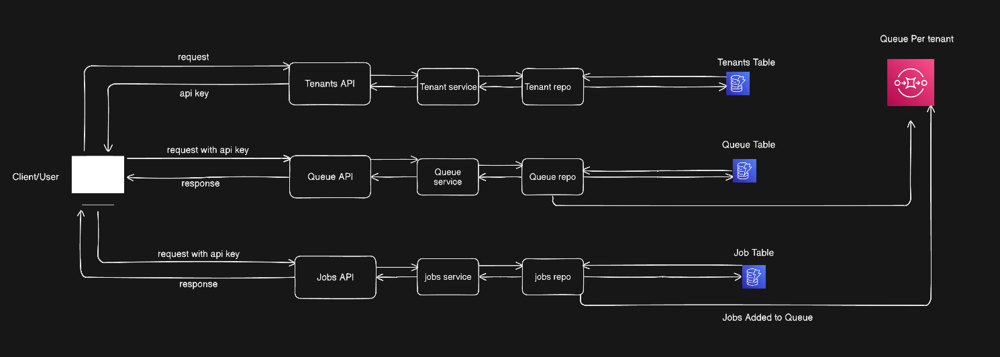
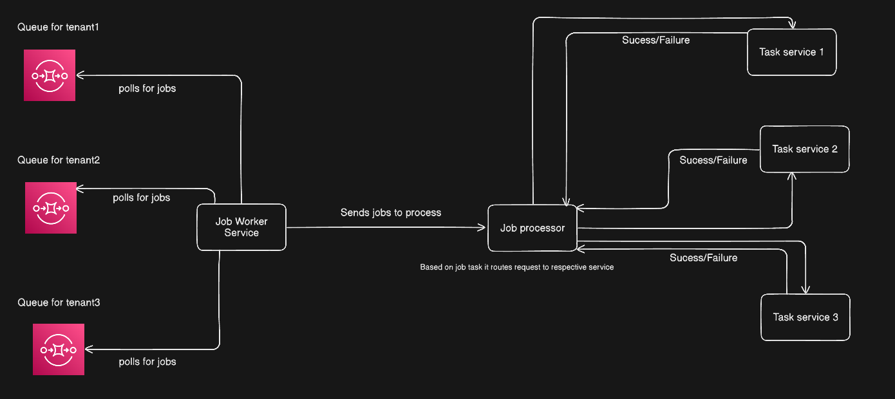
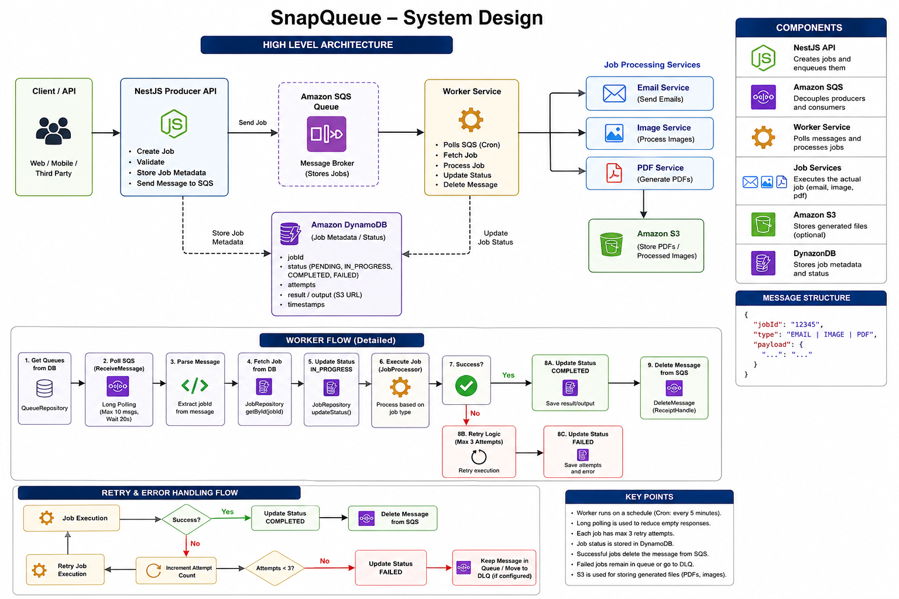

# SnapQueue 🚀

SnapQueue is a background job processing system built with NestJS and TypeScript.  
It uses an event-driven approach to handle async background tasks like emails, image processing, and PDF generation.

---

## Features

- Background job processing
- Event-driven architecture
- Send emails (single & bulk)
- Image processing
- PDF generation
- Optional S3 storage
- Retry & failure handling

---

## Tech Stack

- NestJS (TypeScript)
- Amazon SQS (queue)
- Amazon S3 (storage)
- Amazon DynamoDB (database)

---

## Architecture

---
